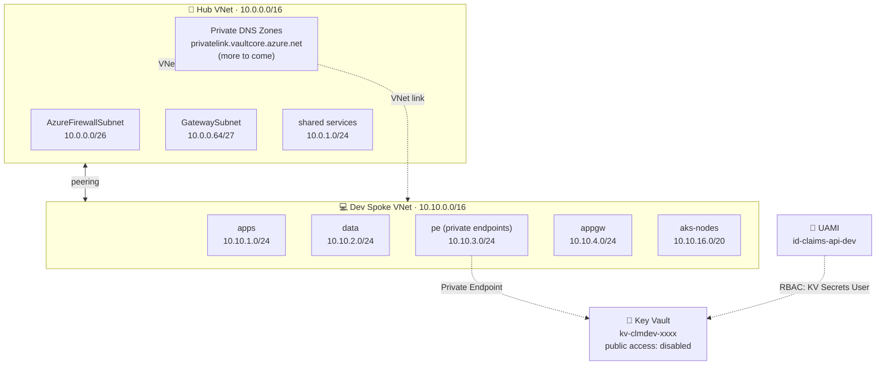

# Contoso Claims Intelligence Platform

> **Enterprise-grade Azure architecture for AI-powered insurance claims processing.**
> A learning project demonstrating end-to-end platform engineering: Terraform, hub-spoke networking, Zero Trust identity, AI services, AKS, observability, and CI/CD.

[](https://www.terraform.io)
[](https://registry.terraform.io/providers/hashicorp/azurerm/latest)
[](LICENSE)

---

## Project goal

Build an enterprise-grade Azure platform that ingests insurance claim documents,
extracts data using Azure AI services, classifies and routes them, exposes
search via RAG, and surfaces insights through a web UI.

The project doubles as a portfolio piece demonstrating fluency with the patterns
and services covered by **AZ-305 (Solutions Architect)**, **AI-102 (AI Engineer)**,
and **DP-203 (Data Engineer)** certifications.

## Architecture

### Network topology



### Layers

| Layer | What's deployed (✓) / planned (⏳) |
|-------|------------------------------------|
| **Foundation** | ✓ Remote state in Azure Storage with blob locking |
| **Governance** | ✓ Naming + tagging conventions, ADRs, pre-commit security scanning |
| **Networking** | ✓ Hub-spoke VNets, NSGs, peering, diagnostic logging to Log Analytics |
| **Identity & Secrets** | ✓ User-Assigned Managed Identity, Key Vault (RBAC mode, PE only), Private DNS |
| **Compute** | ⏳ AKS with Workload Identity, Application Gateway ingress |
| **AI Services** | ⏳ Azure OpenAI, Document Intelligence, AI Search (RAG) |
| **Data Platform** | ⏳ Data Lake Gen2 + Databricks (medallion architecture) |
| **CI/CD** | ⏳ GitHub Actions with OIDC federation, environment approvals |
| **Observability** | ⏳ App Insights, OpenTelemetry, KQL dashboards, Sentinel |

## Repository layout
contoso-claims-platform/
├── .github/workflows/        # CI/CD pipelines (TBD)
├── docs/
│   └── architecture/
│       └── adr/              # Architecture Decision Records
├── infra/
│   ├── bootstrap/            # One-time: creates Terraform state backend
│   ├── modules/              # Reusable Terraform modules
│   │   ├── core/             # Tags + naming conventions
│   │   ├── networking/       # VNet + subnets + NSGs + diagnostics
│   │   ├── vnet_peering/     # Bidirectional peering
│   │   ├── private_dns/      # Private DNS zone with VNet linking
│   │   ├── managed_identity/ # User-Assigned Managed Identity
│   │   ├── key_vault/        # Key Vault with hardening
│   │   └── private_endpoint/ # Generic PE + DNS registration
│   └── environments/
│       └── dev/              # Dev environment composition
└── src/                      # Application code (TBD)
├── api/                  # .NET 9 claims API
└── ui/                   # React + TypeScript frontend
## Architecture decisions

Significant decisions are captured as ADRs in [`docs/architecture/adr/`](docs/architecture/adr/):

- [ADR-001: Bootstrap storage trade-offs](docs/architecture/adr/001-bootstrap-trade-offs.md)

## How to deploy

> **Prerequisites**: Azure subscription, Azure CLI, Terraform 1.9+, an empty GitHub
> repo with the same name. See [`infra/bootstrap/README.md`](infra/bootstrap/README.md)
> for the one-time backend setup.

```bash
# 1. Bootstrap (one-time, creates the Terraform state backend)
cd infra/bootstrap
cp terraform.example.tfvars terraform.tfvars  # edit with your values
terraform init
terraform apply

# 2. Dev environment
cd ../environments/dev
cp backend.example.config backend.config       # paste outputs from bootstrap
cp terraform.example.tfvars terraform.tfvars   # edit with your values
terraform init -backend-config=backend.config
terraform plan -out=dev.tfplan
terraform apply dev.tfplan
```

## Tooling

- **IaC**: Terraform 1.9 with the AzureRM provider 4.10+
- **CI/CD**: GitHub Actions (planned)
- **Languages**: C# (.NET 9), TypeScript (React)
- **Pre-commit hooks**: terraform_fmt, terraform_validate, tflint, Trivy, gitleaks, terraform-docs
- **Secrets**: Azure Key Vault — no secrets in code, ever
- **Identity**: Microsoft Entra ID with Workload Identity for AKS

## Author

**Zohaib Najeeb** — built as a learning project to demonstrate enterprise Azure
architecture patterns. The Azure tenant is owned by a separate party
(reflected in the `Owner` tag on resources, vs the `Maintainer` tag for
the project author).

## License

MIT — see [LICENSE](LICENSE).
